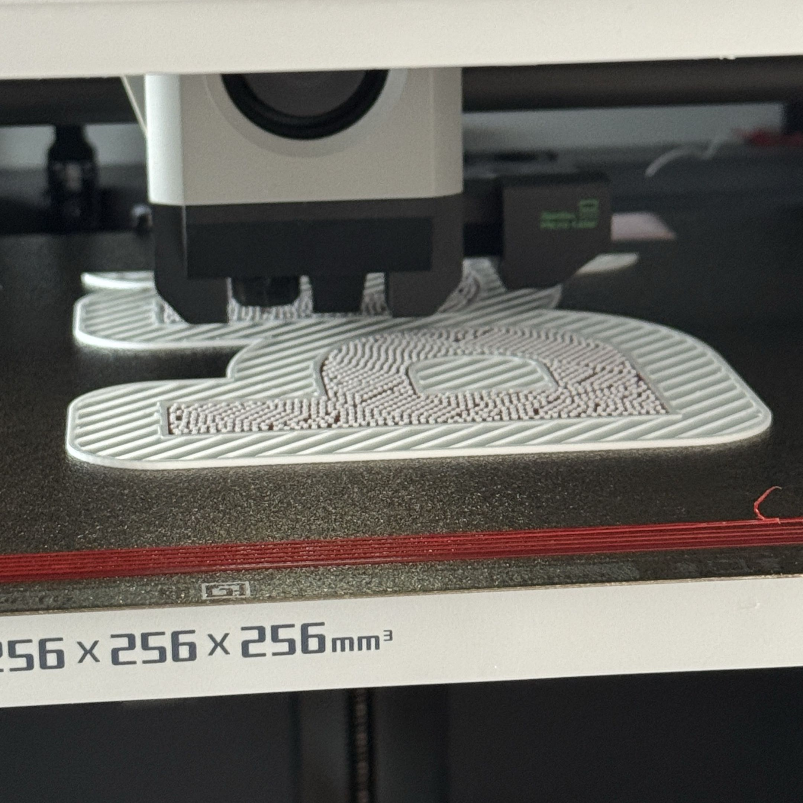
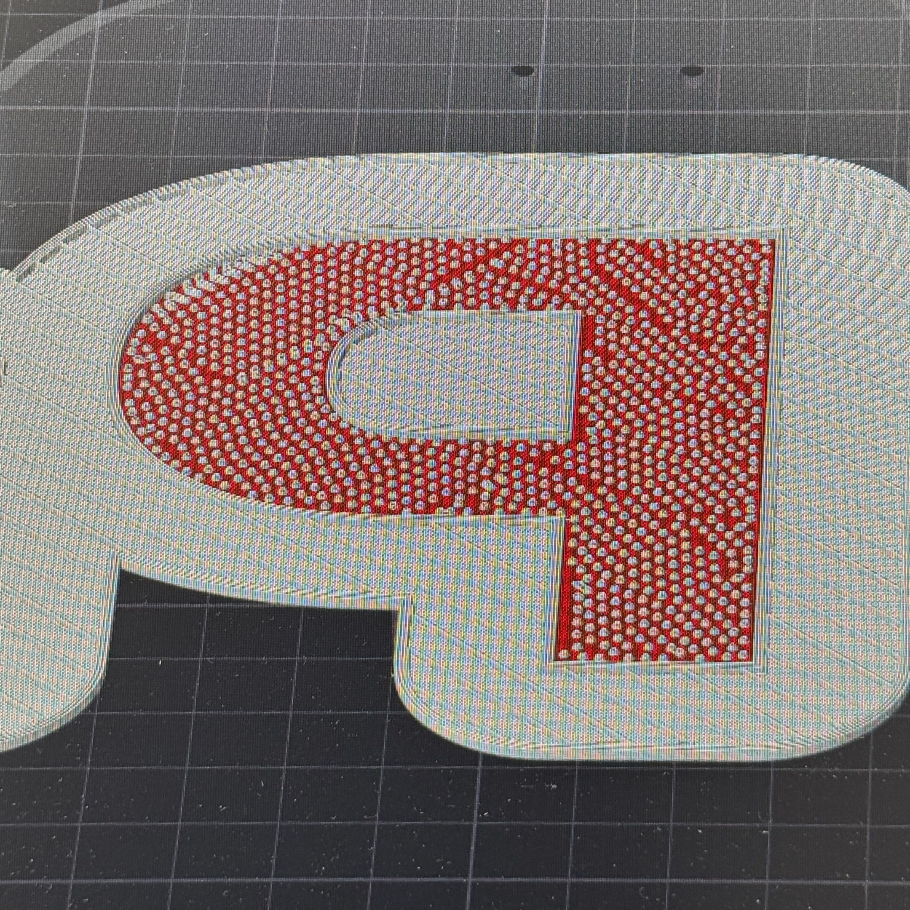

# Documentation continue
Voici la documentation continue de mon travail au sein du MakerSpace. J’y liste et explique chaque journée de travail avec les réussites, les échecs et les solutions envisagées.

## Semaine 1
### Jour 1 (mercredi 10 juin 2026)
J’ai étudié le fonctionnement de la xTool P3 ainsi que les gestes de sécurité à adopter. J’ai également aidé mon camarade à trier les objets utiles et inutiles de la servante dans le stockage du MakerSpace.

### Jour 2 (jeudi 11 juin 2026)

J’ai créé un fichier test dans le logiciel xTool de mon ordinateur portable afin de tester la xTool P3. J’ai ensuite exporté ce fichier en SVG pour pouvoir l’importer dans le logiciel xTool de l’ordinateur connecté à la machine. J’ai utilisé la xTool P3 pour effectuer une découpe et une gravure sur du bois de 5 mm.

### Jour 3 (vendredi 12 juin 2026)

J’ai recherché un fichier permettant de montrer les différents résultats de gravure selon la puissance et la vitesse de gravure de la xTool P3. Certaines combinaisons étaient particulièrement inquiétantes, au point qu’un collègue a été surpris par le résultat obtenu.

## Semaine 2
### Jour 4 (lundi 15 juin 2026)
J’ai rédigé un fichier Word afin d’organiser les informations relatives à la documentation de la xTool P3. J’ai aussi aidé mon camarade à créer les fonds de tiroirs de la servante dans le stockage avec Gridfinity.

### Jour 5 (mardi 16 juin 2026)
J’ai poursuivi la rédaction du document Word permettant le regroupement et l’organisation des informations concernant la xTool P3.

### Jour 6 (mercredi 17 juin 2026)
J’ai continué la rédaction du document et aidé mon camarade à imprimer en 3D ses boîtes de rangement.

### Jour 7 (jeudi 18 juin 2026)
J’ai utilisé un template GitHub basé sur "Just The Docs" afin de créer un site internet hébergé par GitHub. Ce site me permet désormais de documenter la xTool P3 et d’autres machines. J’ai également mis en place une documentation continue, suggérée par un collègue, afin de tester si cette méthode serait pertinente pour les élèves de première année, qui sont souvent moins à l’aise avec les documentations.

### Jour 8 (vendredi 19 juin 2026)
J’ai reporté les jours précédents dans la documentation continue. J’ai aussi aidé mon camarade à ranger la servante dans le stockage.

## Semaine 3
### Jour 9 (lundi 22 juin 2026)
J’ai passé ce 9e jour à préparer un fichier de découpe laser pour faire tenir en place le système Gridfinity de mon camarade. J’attendais de finir une partie de ma documentation pour pouvoir récupérer toutes les photos nécessaires pendant le projet de découpe de ce fichier. J’avais déjà des photos prêtes, mais pas beaucoup d’entre elles faisaient partie du même projet, donc j’ai préféré reprendre toutes les photos dont j’aurai besoin pour créer un fil conducteur propre, en plus de faire cette découpe pour mon camarade.
J’ai ensuite passé une bonne partie de mon après-midi à essayer de résoudre un problème d’affichage récurrent, que j’ai finalement réussi à résoudre… enfin, c’était le cas du moins. Le problème est revenu et je n’ai toujours pas d’idée de comment le résoudre. Installer Ruby et Jekyll devrait m’aider à ce propos, mais mes tentatives d’installation n’ont pas eu l’air très concluantes.
Pendant que l’erreur d’affichage avait été résolue temporairement, j’en ai profité pour avancer sur la documentation de la xTool P3 en créant un menu déroulant sur la barre latérale gauche. J’y ai mis une page d’information en premier. Cette page décrit la P3 lorsque l’on clique dessus. Une fois cette page ouverte, on peut voir une ou plusieurs pages s’afficher sous la page actuelle dans le menu déroulant. J’y ai créé les pages "Sécurité" et "Fonctionnement". Je compte également créer une page "Projet type" dans laquelle je montrerai comment faire un projet très simple que les étudiants pourront réaliser pour mieux connaître la machine, un peu à l’image du tutoriel d’impression 3D dans lequel on apprend à imprimer un petit bateau.

### Jour 10 (mardi 23 juin 2026)
Aujourd’hui, j’ai réalisé ma découpe pour mon camarade. J’en ai profité pour suivre mon tutoriel afin de vérifier les erreurs ou trouver des éléments à reformuler, et j’ai également pris les photos et vidéos nécessaires pour la documentation. Je compte passer l’après-midi à modifier mes photos pour les rendre plus explicites, transformer les vidéos en GIF, bien intégrer les photos et GIF, et espérer que le problème d’affichage ne revienne pas.

### Jour 11 (mercredi 24 juin 2026)
J’ai modifié et renommé toutes mes images afin de les rendre plus explicites grâce à Paint pour les modifications simples, comme un rectangle en rouge pour encadrer un bouton, et à GIMP pour les modifications plus complexes ou précises, comme la colorisation non opaque d’une zone avec des reliefs, notamment visible sur la photo dans l’onglet <a href="https://miyukiwastaken.github.io/Documentation-MiyukiWasTaken/xTool%20P3/securite.html" target="_blank">sécurité</a>. Je continue de travailler sur la rédaction et j’ajuste des détails au fur et à mesure. Test d’insertion d’une image dans securite.md et dans fonctionnement.md, suivi d’une erreur d’affichage.

### Jour 12 (jeudi 25 juin 2026)
Je me mets sérieusement à insérer les images dans le site. Je fais quelques changements de noms de fichiers, notamment pour enlever les apostrophes et éviter les accents comme les `é`. J’essaie également de trouver les symptômes de l’erreur d’affichage 404. J’ai l’impression que les commits de changements trop minimes ***favorisent*** cette erreur d’affichage, mais rien n’est sûr. Les commits comprenant plusieurs fichiers, ou même plusieurs types de fichiers, comme un commit avec un `.md`, un autre `.md` et une image en `.png`, ont réduit les apparitions de cette erreur, mais encore une fois rien n’est sûr. Il semble aussi falloir simplement attendre après le commit et la synchronisation, même après que GitHub affiche les commits comme validés et fonctionnels. J’ai également modifié le **Jour 11** afin d’y mettre un lien hypertexte permettant d’ouvrir la page **Sécurité** dans un autre onglet.

### Jour 13 (vendredi 26 juin 2026)
Je continue à insérer mes photos et GIF dans la documentation et je fais également quelques modifications de texte pour rendre le tout plus clair et compréhensible. J’ai toujours ce problème d’affichage 404 qui revient de temps en temps et qui est toujours d’actualité au moment où j’écris ces lignes. J’essaie également de proposer du texte coloré pour mieux lire les images.

## Semaine 4
### Jour 14 (lundi 29 juin 2026)
J’ai continué de rédiger ma documentation.

### Jour 15 (mardi 30 juin 2026)
J’ai aidé à vider le labo 3 en retirant plusieurs machines, comme des alimentations, des oscilloscopes, etc.
J’ai également débranché tous les périphériques connectés aux ordinateurs et aux écrans, ainsi que tous les câbles branchés sur les multiprises. Le gros des machines se trouve dans la pièce "Cellule" pendant les travaux dans le labo 3. Les microprocesseurs STM-32 pour les TP se trouvent sur une paillasse dans la pièce, car je ne savais pas s’il y avait un endroit pour les ranger. Les chaises de la salle ont été mises dans le couloir par mon camarade et un élève de 4e venu pour un stage d’observation ce jour-là uniquement.

  

### Jour 16 (mercredi 1er juillet 2026)
Aujourd’hui, je vais explorer les fonctions plus avancées de la machine pour permettre aux plus curieux de personnaliser encore plus leurs projets.

### Jour 17 (jeudi 2 juillet 2026)
Aujourd’hui, j’ai découpé plusieurs versions de mon projet perso. J’ai une 5e version prête à être découpée demain.
J’ai réfléchi à la manière d’enrichir la documentation et je pense faire un onglet "Logiciel xTool". Je ne sais pas encore s’il faut le placer comme sous-onglet de la rubrique xTool P3 ou au même niveau que la documentation continue ou l’accueil.

### Jour 18 (vendredi 3 juillet 2026)
Aujourd’hui, je me suis lancé dans un remaniement de mon site. J’ai créé les pages pour la F2 Ultra afin d’optimiser mon temps, et j’ai également créé un dossier de pages "Autres missions" pour regrouper les missions annexes que j’ai pu réaliser pendant ce stage, mais qui n’étaient pas liées à la documentation des machines. Parmi ces missions, j’ai pour l’instant mis celle du rangement des servantes ainsi que le rangement et le vidage du Labo 3, avec leurs photos. Si le site sur GitHub bug, c’est potentiellement à cause du texte coloré sur la page du rangement.

## Semaine 5
### Jour 19 (lundi 6 juillet 2026)

Avec mon camarade, nous avons réorganisé les deux étagères des imprimantes 3D afin de faire de la place pour deux nouvelles imprimantes qui viennent d’arriver.

Nous avons commencé par débrancher toutes les imprimantes de l’étagère de droite. Avant de les retirer, nous avons enlevé les scratchs qui maintenaient les câbles, puis identifié chaque imprimante avec un morceau de scotch sur lequel nous avons écrit son numéro afin de ne pas les mélanger pendant le remontage. Nous avons ensuite retiré les imprimantes, leurs supports, puis démonté les différents étages de l’étagère.

L’étage du milieu et celui du haut ont été remontés plusieurs crans plus haut afin de libérer un troisième niveau pour accueillir deux imprimantes supplémentaires. Pendant le remontage, nous avons dû inverser les traverses de deux étages afin de redescendre la multiprise à une hauteur accessible à tous, ce qui nous a également obligés à déplacer les numéros des machines.
Nous avons ensuite revissé les supports noirs des imprimantes.

Après avoir changé la disposition des étages, nous avons donc remis les imprimantes sur les supports, puis nous les avons rebranchées, avant de faire du **cable management** afin d’éviter d’avoir des câbles qui traînent partout et peuvent gêner les imprimantes.

  

### Jour 20 (mardi 7 juillet 2026)

Le lendemain, nos responsables nous ont informé qu’ils avaient remarqué que les étagères avaient finalement été remontées un peu trop haut, ce qui compliquait l’accès aux imprimantes pour les personnes de petite taille. Nous avons donc redémonté les étages et les avons redescendus de quelques crans avant de tout remonter.

Une fois l’étagère de droite terminée, nous avons appliqué le même principe sur l’étagère de gauche. Nous avons débranché les imprimantes et la multiprise, retiré les scratchs, enlevé les imprimantes et leurs supports, puis déplacé les étages en faisant également attention à repositionner la multiprise au bon endroit. Les supports ont dû être légèrement décalés à cause des câbles présents sur le mur. Nous avons ensuite remis les imprimantes, rebranché tous les équipements, refait le câble management avec les scratchs, vérifié que les numéros des machines correspondaient bien et déplacé certains porte-bobines.

Les deux étagères sont maintenant prêtes. Celle de droite accueille désormais six imprimantes (deux par étage) et celle de gauche est déjà prête pour recevoir deux imprimantes supplémentaires lorsqu’elles arriveront. Il reste encore à fabriquer les plaques des machines 11 et 12, imprimer de nouveaux porte-bobines ainsi que de nouveaux bacs à purges.

### Jour 21 (mercredi 8 juillet 2026)

Aujourd’hui, j’ai continué ma documentation sur l’organisation des imprimantes et j’ai commencé à y mettre des images.

Un collègue a partagé à mon camarade et moi les fichiers 3D afin que l’on produise les supports bobines et les supports d’étiquette.
Je devais récupérer un fichier `.svg` ou `.dxf` à partir de ces modèles 3D. J’ai donc récupéré sur ces fichiers cette pièce, la dupliqué dans un autre fichier à côté, puis créé une esquisse sur la face de cette pièce et appuyé sur `U`, qui, sur OnShape, permet de copier tous les contours d’une face d’une pièce sur l’esquisse. Cela rend la vie beaucoup plus facile, car je n’ai pas besoin de récupérer les mesures de la pièce et de refaire tout à la main.
Sans cette méthode, il était impossible pour moi de récupérer un fichier `.dxf` de cette pièce.

Mon camarade et moi sommes ensuite partis aider nos collègues à sortir des objets sans intérêt et des déchets du stockage, puis nous avons dû déplacer la ***`[nom de la machine à résine]`*** dans le PrinterLab afin de pouvoir déplacer la servante. Une fois cette machine déplacée, nous avons retiré les tiroirs de la servante, déplacé la servante du ResinLab au stockage, puis remis les étages.

  
  
  

### Jour 22 (jeudi 9 juillet 2026)

Journée en télétravail pendant laquelle j’ai amélioré ma documentation en créant les pages sur mes missions, en les documentant et en y ajoutant des images.

### Jour 23 (vendredi 10 juillet 2026)

Ce jour-là, nous avons continué de documenter nos réalisations en les illustrant avec des images et en étant clairs dans nos explications.

Nous avons également eu pour mission de recoller la mousse acoustique du MédiaLab, qui s’était décollée à cause de la chaleur. Il a fallu les recoller assez vite tout en le faisant proprement, car il y avait une visite mercredi 15 juillet en après-midi. Les lundi et mardi étant des jours de congés, nous n’avions que ce vendredi après-midi ainsi que le mercredi matin pour le faire. Nous l’avons bouclé ce vendredi, mais nous avons également conclu que nous devrions revérifier l’état des mousses le mercredi. Si notre manière de recoller les mousses n’a pas été concluante et que des mousses se sont décollées, il faudra toutes les enlever du mur pour au moins avoir des murs propres.

  
  

## Semaine 6
### Jour 24 (lundi 13 juillet 2026)

Pont du 14 juillet.

### Jour 25 (mardi 14 juillet 2026)

14 juillet, fête nationale. <!--(on perd 2-0 contre l’Espagne en demi-finale à cause de l’immonde Tchouaméni)-->

### Jour 26 (mercredi 15 juillet 2026)

Aujourd’hui, nous avons vérifié les mousses acoustiques et… elles sont tombées. Le côté droit est **complètement** tombé, tandis que le côté gauche était également décollé mais les mousses sont quand même restées _**sur le mur**_. Nous avons donc décidé de toutes les enlever et de les ranger dans un coin de la pièce pour ne pas avoir la pièce en désordre lors du passage de la visite. Nous avons également enlevé les scotchs double-face qui étaient présents sur le mur pour rendre le tout moins brouillon.

  
  

Nous avons également jeté des cartons et les avons mis dans le ResinLab, qui, pour l’instant, est surtout utilisé comme poubelle et espace de mise de côté des objets non voulus.

En fin de journée, nous avons déplacé tous les cartons et autres objets du labo 3 vers le labo 4 pour que les paillasses du labo 3 puissent être démontées vendredi.

  
  
  

### Jour 27 (jeudi 16 juillet 2026)

J’ai continué ma documentation en mentionnant nos missions de déplacement de servante et de recollage des mousses acoustiques. Nous avons également aidé deux personnes de Unimakers à changer le support de leur table de test de robots.

### Jour 28 (vendredi 17 juillet 2026)

J’ai assemblé les porte-bobines et je les ai vissées à l’étagère des imprimantes. Il me manque juste les étiquettes pour les imprimantes 9, 10 (pas encore existantes), 11 et 12 (en place) pour finir le tout, mais je n’ai pas le fichier fait pour. Je devrais le recréer moi-même s’il n’est pas retrouvé bientôt.

## Semaine 7
### Jour 29 (lundi 20 juillet 2026)

J’ai continué ma documentation, et nous devons penser à faire des impressions 3D de textes pour chaque pièce du MakerSpace afin de les rendre plus lisibles à ceux qui viennent rarement.

### Jour 30 (mardi 21 juillet 2026)

Encore de la documentation.

J’ai également commencé à faire les textes similaires au "RepairSpace" pour les accrocher au plafond à côté de chaque pièce.

### Jour 31 (mercredi 22 juillet 2026)

Nous avons une mini-soutenance vendredi 24, et nous avons donc réfléchi au plan que nous allions appliquer pour construire notre diaporama. Nous sommes tombés en désaccord sur les titres à mettre dans le sommaire, mais nous avons finalement compris que le problème venait d’un malentendu : j’avais mal expliqué mon point de vue à mon camarade, et il a fallu 1 h 30 pour finalement faire tomber le malentendu et être d’accord.

### Jour 32 (jeudi 23 juillet 2026)

Journée en télétravail, nous avons fait notre diaporama pour notre mini-soutenance, ce qui nous permettra de corriger des problèmes de contenu ou de présentation sans avoir besoin de refaire toute la soutenance directement.

### Jour 33 (vendredi 24 juillet 2026)

Nous avons passé notre mini-soutenance et reporté ses problèmes afin de ne pas reproduire les mêmes erreurs pour la soutenance finale. Tous ces problèmes repérés nous permettront de réaliser une meilleure soutenance.

## Semaine 8
### Jour 34 (lundi 27 juillet 2026)

J’ai passé cette journée à préparer et rédiger un paragraphe de contexte général du stage pour que l’intégralité de mon rapport soit contenue dans ce projet de site internet. C’est d’ailleurs une forme de rapport qui pourrait être utilisée pour les futurs étudiants, car il permet d’apprendre un langage de rédaction et de mieux appréhender les éditeurs de code comme ***VS Code***, le tout en étant un moyen plus divertissant et intéressant qu’une rédaction banale et brusque d’un rapport assez fade.

### Jour 35 (mardi 28 juillet 2026)

Mon collègue m’a demandé d’imprimer en 3D les noms des différentes pièces du MakerSpace. J’ai donc commencé à modéliser ces textes avec des logiciels comme ***Inkscape*** et ***OnShape***.

### Jour 36 (mercredi 29 juillet 2026)

J’ai continué le premier texte et j’ai fait en sorte de le séparer en plusieurs parties, puisque le plateau d’impression des BambuLab A1 Mini n’est pas assez grand pour accueillir le texte entier. J’ai également mis une coque pour éviter d’utiliser du filament pour rien, car en faire un bloc n’aura aucune utilité qui vaut l’utilisation de grammes de filament supplémentaires.

### Jour 37 (jeudi 30 juillet 2026)

J’ai lancé l’impression 3D du "Pr" de mon texte (PrinterLab), mais j’ai rencontré un problème assez spécial avec les supports.
Dans l’impression, j’ai dû faire des extrusions pour enlever et ajouter de la matière afin de créer une pièce différente pour chaque lettre et coque du modèle 3D, de façon à pouvoir les sélectionner séparément dans OrcaSlicer, qui permet de lancer les impressions. Cependant, j’avais enlevé trop de matière pour les lettres et il y avait donc un vide dans ma pièce, qui a été partiellement rempli par des supports (2 mm enlevés, 0,6 mm de remplissage, il manquait donc 1,4 mm à combler), comme le montrent les images ci-dessous, qui présentent les résultats réel et dans le logiciel.

  
  

Mon collègue m’a également demandé de mettre ma documentation sur la xTool P3 sur le site officiel du MakerSpace pour que les étudiants puissent y accéder sans avoir à faire cinq détours par des GitHub inconnus. Je me pencherai sur cette tâche plus sérieusement demain, mais je regarde comment le site fonctionne et comment je pourrais y adapter ma documentation sur la découpeuse laser.
Je devrais documenter en premier lieu la machine, puis ensuite documenter son utilisation, ou même adapter ma documentation pour que les étudiants réalisent un mini projet simple afin d’aborder les notions principales de la machine.

### Jour 38 (Vendredi 31 juillet 2026)

J'ai continué à comprendre comment le site fonctionnait, comment il était construit, puis j'ai commencé à adapter la docuentation du MakerSpace en local pour y faire paraitre la xTool P3 dans la liste des machines. J'ai créé une page à son nom dans laquelle figure son nom, quel type de machine c'est, les fichiers qu'elle utiliser, etc.

C'est un travail assez long donc je n'ai pas reussi à le finir aujourd'hui, tout en notant que j'étais absent toute l'après-midi au cause d'un rendez-vous dans une association. J'essaierais de continuer d'adapter ma documentation au sein du site officiel du MakerSpace pendant les vacances et plus tard si besoin, et j'essaierais de graver avec la découpeuse laser le code QR qui renvoie à la page du tutoriel, afin de pouvoir y acceder dans la pièces très facilement avec les téléphones des étudiants.